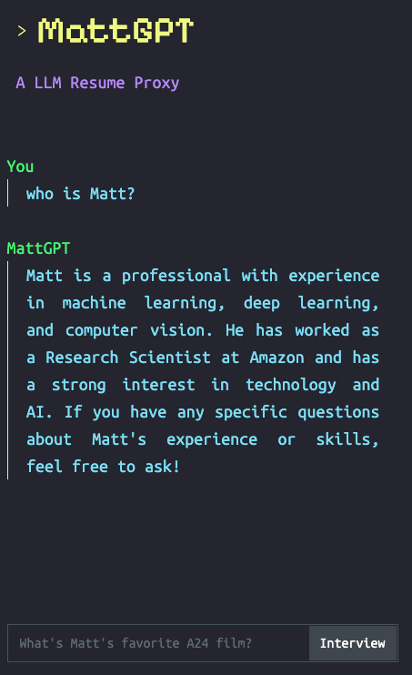

# MattGPT

This is a personal webapp I created to serve as a LLM version of my resume. I created it using Flask, and a ChatGPT bot that was given my work history along with some personal information. It comes in two themes.

  
   

